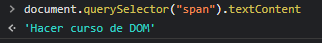
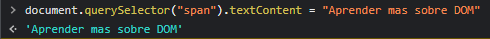

# DOM

## Este curso comienza con material descargado y creación de ramas en GIT

### Creo repo y nueva rama
 
Lo hice de manera manual para practicar

`Git checkout -b "clase-01"` 

### DOM
 
Comenzamos con ejemplo en consola F12, `Document.queryselector` selecciono el elemento en este caso `li`.
También puedo seleccionar la clase `Document.queryselector` selecciono la clase en este caso `.card`, que me lleva al 
mismo resultado

### Modificar desde consola F12

**NOTA: con flecha arriba abajo navego los comandos usados en consola**

Selecciono la etiqueta que quiero modificar `span` + `.textcontent` puedo vizualizar y si agrego un igual modifico.
No modifica al archivo original, con F5 vuelve a la normalidad.

 -.-.-.- 

Utilizamos el método querySelector para recorrer el árbol del DOM y encontrar el elemento que queremos utilizando 
JavaScript. Pero, existen otros métodos que pueden ser usados con la misma finalidad.

* `document.getElementById(‘id’)` selecciona el elemento por el `id`
* `document.getElementsByClassName(‘clase’)` retorna un arreglo de los elementos por el nombre de la `clase`
* `document.getElementsByTagName(‘tag’)` retorna un arreglo de los elementos por el nombre del `tag`
* `document.querySelectorAll(“selector”)` regresa todos los elementos con el mismo nombre

### Escuchando eventos

.