# DOM

## Este curso comienza con material descargado y creación de ramas en GIT

### Creo repo y nueva rama
 
Lo hice de manera manual para practicar

`Git checkout -b "clase-01"` 

### DOM
 
Comenzamos con ejemplo en consola F12, `Document.queryselector` selecciono el elemento en este caso `li`.
También puedo seleccionar la clase `Document.queryselector` selecciono la clase en este caso `.card`, que me lleva al 
mismo resultado

### Modificar desde consola F12

**NOTA: con flecha arriba abajo navego los comandos usados en consola**

Selecciono la etiqueta que quiero modificar `span` + `.textcontent` puedo vizualizar y si agrego un igual modifico.
No modifica al archivo original, con F5 vuelve a la normalidad.

 -.-.-.- 

Utilizamos el método querySelector para recorrer el árbol del DOM y encontrar el elemento que queremos utilizando 
JavaScript. Pero, existen otros métodos que pueden ser usados con la misma finalidad.

* `document.getElementById(‘id’)` selecciona el elemento por el `id`
* `document.getElementsByClassName(‘clase’)` retorna un arreglo de los elementos por el nombre de la `clase`
* `document.getElementsByTagName(‘tag’)` retorna un arreglo de los elementos por el nombre del `tag`
* `document.querySelectorAll(“selector”)` regresa todos los elementos con el mismo nombre

### Escuchando eventos

Genero una nueva rama:

Creo y hago link para archivo `script.js` 

Voy a escuchar al botón agregar con el _atributo_ `data` la referencia o nombre que agregue luego la decido yo.

### Capturando el valor del input

Dentro de la function que escucha al botón ==> escucho al input dentro de la función porque quiero sus datos luego de 
hacer click, a partir de ahí capturo su contenido.

### Comportamiento del formulario

Con el método `preventDefault()` evito que se recargue la pantalla cada vez que cargo un dato en el formulario.
en este caso nombré al parámetro de la función `parameterEvento` , pero No limpia el formulario!!!

Luego a la función la transforma en arrow function.

El próximo cambio importante es que transforma la arrow function en el contenido de otra función para mejorar la sintaxis.

## Clase 3 

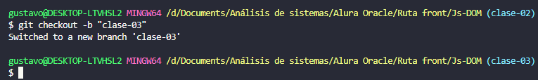

Para hacer que los datos de borren del form al hacer input hago lo siguiente:

* Almaceno el input en una variable `const value = input.value;`
* Declaro que quede vacío --- de esta manera guarda una vez pero vacía el form.

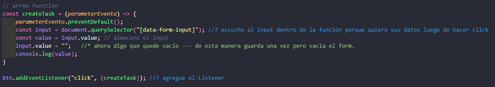

### Creo la nueva tarea en la lista

En el HTML asigno un nuevo `data-` para manejar la creación de tareas.

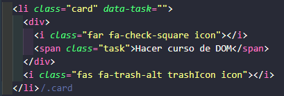

* Luego lo capturo en javascript en una constante: `const task = document.querySelector("[data-task]");`
* vuelvo al HTML y corto el contenido de la etiqueta nombrada `data-task`
* Creo una nueva constante para el contenido recien cortado y manejarlo dentro de Js. va a ser igual a una propiedad 
que tiene JavaScript que se llama `template strings`.
* Dentro de la constante hago una llamada a una variable de js para insertarla utilizo `${ }`

Con esto al hacer click capture el contenido e imprime el código insertado de la etiqueta html en js

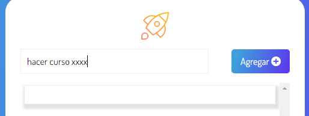 -- 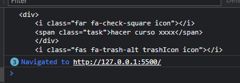

Falta que ahora el código de etiqueta se vuelva a insertar dentro del html para generar UNA nueva etiquetas lo hago con 
la propiedad `.innerHTML` TODAVÍA NO LAS GUARDA

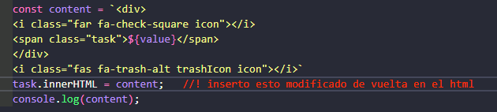

### Creando elementos

Habiendo manipulado el DOM ahora el profesor muestra como hacer cada tarjeta dinámica para eso modifica aún más el proyecto.

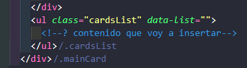

Al elemento padre Ul le agregué un `data-` para manipularlo, creo en js con`const task = document.createElement("li");`
 _creo un list item para agregar las tarjetas_.

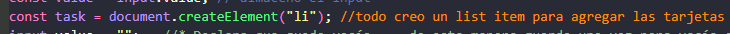

Con la sintaxis `.appendChild` creo un hijo a la ul

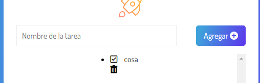

lo agrega sin formato para agregar la clase css debo usar: 
* `task.classList.add("card");` // con esto agrego la clase a la tarea.

 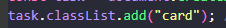 -- 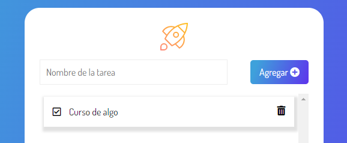

.