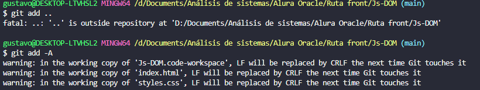
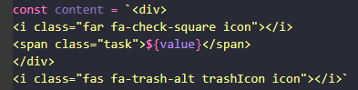
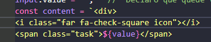
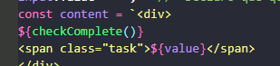
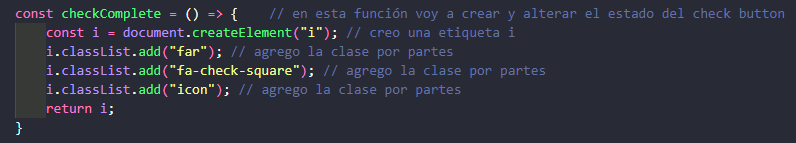
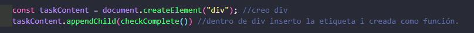
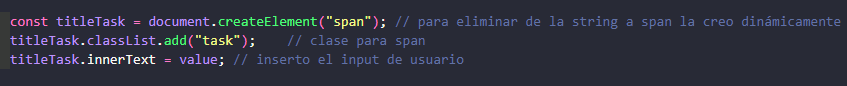
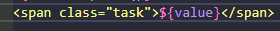
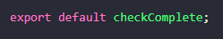
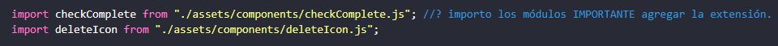

# DOM

## Este curso comienza con material descargado y creación de ramas en GIT

### Creo repo y nueva rama
 
Lo hice de manera manual para practicar

`Git checkout -b "clase-01"` 

### DOM
 
Comenzamos con ejemplo en consola F12, `Document.queryselector` selecciono el elemento en este caso `li`.
También puedo seleccionar la clase `Document.queryselector` selecciono la clase en este caso `.card`, que me lleva al 
mismo resultado

### Modificar desde consola F12

**NOTA: con flecha arriba abajo navego los comandos usados en consola**

Selecciono la etiqueta que quiero modificar `span` + `.textcontent` puedo vizualizar y si agrego un igual modifico.
No modifica al archivo original, con F5 vuelve a la normalidad.

 -.-.-.- 

Utilizamos el método querySelector para recorrer el árbol del DOM y encontrar el elemento que queremos utilizando 
JavaScript. Pero, existen otros métodos que pueden ser usados con la misma finalidad.

* `document.getElementById(‘id’)` selecciona el elemento por el `id`
* `document.getElementsByClassName(‘clase’)` retorna un arreglo de los elementos por el nombre de la `clase`
* `document.getElementsByTagName(‘tag’)` retorna un arreglo de los elementos por el nombre del `tag`
* `document.querySelectorAll(“selector”)` regresa todos los elementos con el mismo nombre

### Escuchando eventos

Genero una nueva rama:

Creo y hago link para archivo `script.js` 

Voy a escuchar al botón agregar con el _atributo_ `data` la referencia o nombre que agregue luego la decido yo.

### Capturando el valor del input

Dentro de la function que escucha al botón ==> escucho al input dentro de la función porque quiero sus datos luego de 
hacer click, a partir de ahí capturo su contenido.

### Comportamiento del formulario

Con el método `preventDefault()` evito que se recargue la pantalla cada vez que cargo un dato en el formulario.
en este caso nombré al parámetro de la función `parameterEvento` , pero No limpia el formulario!!!

Luego a la función la transforma en arrow function.

El próximo cambio importante es que transforma la arrow function en el contenido de otra función para mejorar la sintaxis.

## Clase 3 

Para hacer que los datos de borren del form al hacer input hago lo siguiente:

* Almaceno el input en una variable `const value = input.value;`
* Declaro que quede vacío --- de esta manera guarda una vez pero vacía el form.

### Creo la nueva tarea en la lista

En el HTML asigno un nuevo `data-` para manejar la creación de tareas.

* Luego lo capturo en javascript en una constante: `const task = document.querySelector("[data-task]");`
* vuelvo al HTML y corto el contenido de la etiqueta nombrada `data-task`
* Creo una nueva constante para el contenido recien cortado y manejarlo dentro de Js. va a ser igual a una propiedad 
que tiene JavaScript que se llama `template strings`.
* Dentro de la constante hago una llamada a una variable de js para insertarla utilizo `${ }`

Con esto al hacer click capture el contenido e imprime el código insertado de la etiqueta html en js

 -- 

Falta que ahora el código de etiqueta se vuelva a insertar dentro del html para generar UNA nueva etiquetas lo hago con 
la propiedad `.innerHTML` TODAVÍA NO LAS GUARDA

### Creando elementos

Habiendo manipulado el DOM ahora el profesor muestra como hacer cada tarjeta dinámica para eso modifica aún más el proyecto.

Al elemento padre Ul le agregué un `data-` para manipularlo, creo en js con`const task = document.createElement("li");`
 _creo un list item para agregar las tarjetas_.

Con la sintaxis `.appendChild` creo un hijo a la ul

lo agrega sin formato para agregar la clase css debo usar: 
* `task.classList.add("card");` // con esto agrego la clase a la tarea.

  -- 

Todos los elementos en nuestro árbol de DOM son nodos y todos los nodos pueden ser accedidos vía JavaScript. 
Los nodos pueden ser eliminados, creados o modificados. Durante el curso utilizamos el método appendChild que siempre 
es implementado al final del nodo, para colocar un nodo hijo dentro del nodo padre.

Existen otros métodos que podemos utilizar para manipular nodos:

* insertBefore(padre, hijo): Coloca un nodo antes del otro
* replaceChild(elemento1, elemento2): Sustituye el nodo del elemento 1 por el nodo del elemento 2
* removeChild(elemento): Remueve un nodo del árbol

**Lo que aprendimos en esta aula:**

* Utilizar template strings
* Colocar un elemento hijo dentro del elemento padre utilizando el método appendChild
* Crear elementos utilizando el método createElement

### Creando el botón concluir / chequeado

### Clase-04 ahora ya no me sirve mezclar una string con tantos elementos html asi que debo crear uno a uno

Para hacer dinámico al botón de check list debo crearlo en js también, lo hago a través de una función.

Dentro de la misma: 
1. Creo la etiqueta "i"
2. Le asigno las clases =  `i.classList.add("far");`
3. Le asigno las clases =  `i.classList.add("fa-check-square");`
4. Le asigno las clases =  `i.classList.add("icon");`
5. Las debo separar una a una porque si no da error.
6. Retorno "i" 

Reemplazo dentro la etiqueta li a la vieja etiqueta i con la función nueva.

 ----- 

Clase-04 ahora ya no me sirve mezclar una `string` con tantos elementos html asi que debo crear uno a uno 
comienzo a crear las etiquetas dinámicamente y voy borrando la string.

Creo el div y le inserto la etiqueta i

Para eliminar de la string a span la creo dinámicamente:

Ahora borro la parte de la string con span:

## IIFE Immediately invoked function expression 

Son funciones que en cuanto se declaran, se ejecutan.

**_Para dar más seguridad a nuestro código._**

Una IIFE (Immediately Invoked Function Expression) constituye un patrón de diseño usado comúnmente en Javascript 
(por bibliotecas, como jQuery, Backbone.js, Modernizr, y muchas más) para encapsular un bloque de código dentro de un 
ámbito local.

**Lo que aprendimos en esta aula:**

* Agregar la clase CSS utilizando el método toggle
* Utilizar el atributo parentElement para subir un elemento en el árbol del DOM
* Encontrar el objetivo del evento utilizando la propiedad target
* Utilizar IIFE

## Clase 5
Trabajamos en el botón de borrar con la misma logica del check

## Módulos

Digo en HTML que el tipo de script va a ser de módulos
 
 

Creo la exportación en el archivo módulo y la importación en el script principal.

.